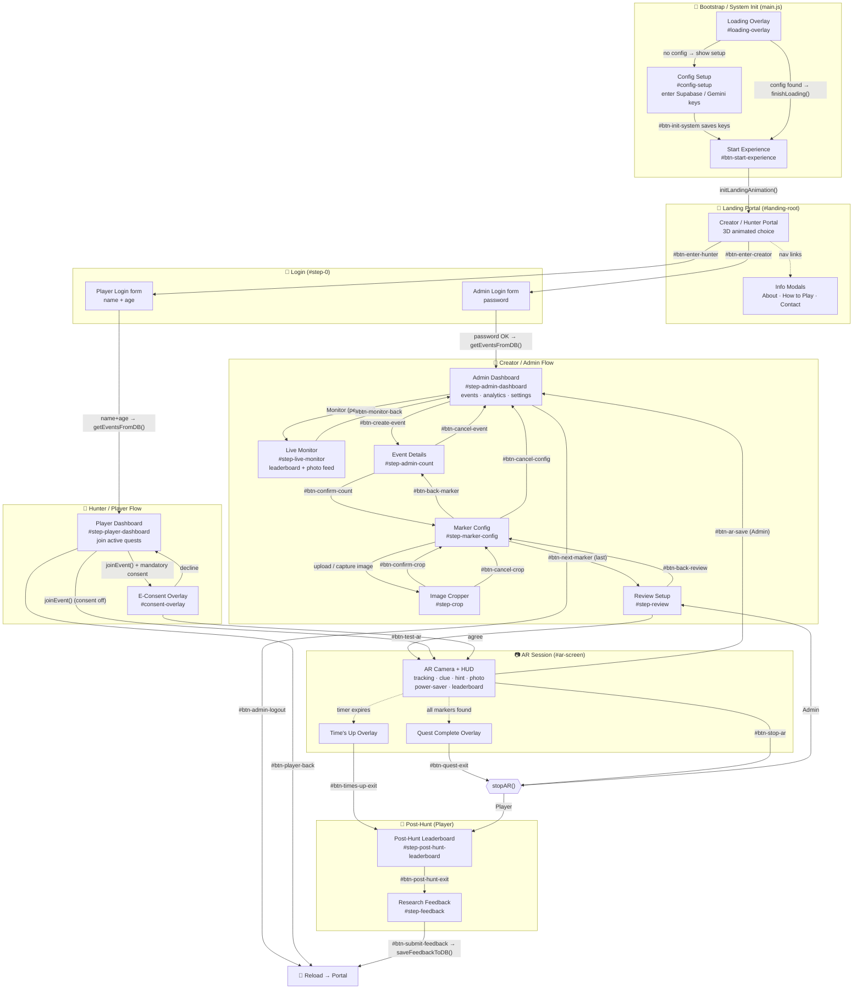

# ARTHunt — Navigation Map

This document describes every screen in the AR Treasure Hunt single-page app, how
the user moves between them, and which code drives each transition. The app is a
single `index.html` whose "screens" are shown/hidden by toggling CSS classes and
`display` styles — there is no router. Panel switching goes through
`showPanel()` in [`js/utils.js`](../js/utils.js); full-screen modes
(landing / setup / AR) are toggled directly in [`main.js`](../main.js).

## Flow diagram

> Solid arrows = explicit user navigation (button/action). Dashed arrows =
> automatic transitions triggered by game state (quest completion, timer, nav links).

## Screen reference

Panels registered in `sections` ([`js/utils.js`](../js/utils.js)) and shown via `showPanel()`:

| Screen | Element ID | Reached from | Leaves to |
| --- | --- | --- | --- |
| Loading / Config | `#loading-overlay`, `#config-setup` | app start (`initSystem`) | Landing (Start Experience) |
| Landing Portal | `#landing-root` | Start Experience | Admin/Player login |
| Login | `#step-0` (`sections.welcome`) | portal enter buttons | Admin/Player dashboard |
| Admin Dashboard | `#step-admin-dashboard` | admin login OK | Create event, Monitor, logout |
| Live Monitor | `#step-live-monitor` | dashboard event → Monitor | back to dashboard |
| Event Details | `#step-admin-count` | Create Event | Marker Config / cancel |
| Marker Config | `#step-marker-config` | Event Details / crop return | Crop, Review, back |
| Image Cropper | `#step-crop` | upload/capture in Marker Config | back to Marker Config |
| Review Setup | `#step-review` | last marker configured | Test AR, back |
| Player Dashboard | `#step-player-dashboard` | player login OK | Join quest (AR) |
| AR Session | `#ar-screen` | Test AR (admin) / Join (player) | Review / Post-hunt / Dashboard |
| Post-Hunt Leaderboard | `#step-post-hunt-leaderboard` | end of hunt / time up | Feedback |
| Research Feedback | `#step-feedback` | Post-Hunt Leaderboard | reload → portal |

## Overlays (shown on top of a screen, not routed via `showPanel`)

| Overlay | Element ID | Trigger | Exit |
| --- | --- | --- | --- |
| E-Consent | `#consent-overlay` | `joinEvent()` when `mandatoryConsent` on | Agree → start AR · Decline → cancel |
| Quest Complete | `#quest-complete-overlay` | all markers found | Exit → stop AR · Stay → dismiss |
| Time's Up | `#times-up-overlay` | quest timer reaches 0 | Exit → Post-Hunt Leaderboard (auto after 4s) |
| Power Saver | `#power-save-overlay` | camera toggle in AR HUD | Resume camera |
| Photo Confirm | `#ar-photo-confirm-overlay` | HUD selfie capture | Post → upload · Cancel |
| Info Modal | `#info-modal` | landing nav links | Close |

## Two primary journeys

- **Creator:** Portal → Admin Login → Dashboard → Create Event → Event Details →
  Marker Config (↔ Cropper, repeated per marker) → Review → Test AR →
  Save Event (`#btn-ar-save`) back to Dashboard.
- **Hunter:** Portal → Player Login → Player Dashboard → Join (E-Consent) →
  AR Session (scan markers in sequence, hints, dashcam/selfie photos) →
  Post-Hunt Leaderboard → Research Feedback → reload to Portal.

## Module map

| Module | Responsibility |
| --- | --- |
| [`main.js`](../main.js) | App bootstrap, all screen wiring, dashboards, hunter/creator flows, timers, photo capture, settings |
| [`js/utils.js`](../js/utils.js) | `showPanel()`, `sections` registry, DOM helpers, `escapeHtml`, `roundRect` |
| [`js/state.js`](../js/state.js) | Global `state` object, settings, config |
| [`js/db.js`](../js/db.js) | Supabase: events, feedback, file/base64 uploads |
| [`js/ar-engine.js`](../js/ar-engine.js) | MindAR + Three.js session, marker sequence validation, capture, start/stop/pause |
| [`js/loaders.js`](../js/loaders.js) | 3D model loaders (glb/gltf/fbx/obj/stl/dae/ply), text cards |
| [`js/cropper.js`](../js/cropper.js) | Interactive marker image cropper |
| [`js/landing.js`](../js/landing.js) | Animated 3D landing portal |
| [`js/confetti.js`](../js/confetti.js) | Quest-completion confetti |
| [`api/get-config.js`](../api/get-config.js) | Vercel serverless endpoint serving runtime config |
